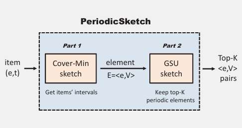
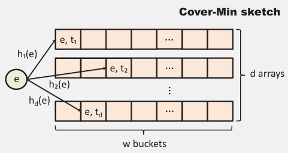
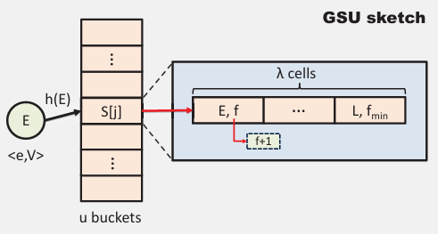

# PeriodicSketch

本文聚焦于研究数据流中的周期性项目，即经过固定时间间隔出现的项目。

由于现有的挖掘周期性模式的方法在数据流中的不适用，本文提出了一种新型的 Sketch 来精确记录 top-K 周期性项目。

考虑统计间隔的重复出现，使用频率来表示间隔出现的次数。为了统计高频间隔，使用 Guaranteed Soft Uniform（GSU） 替换策略。

测试结果表明，该方案只需十分之一的内存，平均绝对误差（AAE）大约比基线方法小 700+ 倍。

## 引言

### 背景和动机

近来，数据流测量变得越来越重要，而大量的数据与有限的内存，使得保持高速和精确的测量很困难。因此许多基于概率的数据结构被提出来解决这个问题，它们使用的更小的内存，提供一个误差较小的估计，称为 sketches。它们通常用于一般性测量，如频率测量、持久性测量、超级传播者测量等。

本文主要关注数据流中周期性项目的测量，这是一个重要的问题，下面用四个例子来说明：

- Cache：如果可以识别周期性的输入，就可以优化缓存的载入和驱逐策略，提高缓存的命中率
- APT 检测：高级长期威胁通常具有大危害、长时间、难检测的特点。实际上，攻击者通常会在工作时间或节假日进行攻击，并且攻击成功后的数据回传也是周期性的，因此可以通过检测周期性的数据流来检测 APT 攻击
- 网络流预测和分类：网络流中的周期性行为可以帮助机器学习模型给出更好的预测结果，也可以一定程度上降低模型的复杂度
- 金融交易或网购：周期性的交易行为可能是非法市场操纵的信号；周期性的点击或购买行为可以帮助预测用户的偏好

为了找出周期性项目，基本的方案是使用大量的布隆过滤器和 Space-Saving 算法。其中布隆过滤器被用于记录项目的出现，Space-Saving 则用于计算 top-K 项目。具体些，如果周期分布在 [1s, 10000s]，那么使用 10000 个 Sketch 来分别统计，最后遍历所有的 Sketch 来更新 Space-Saving 的数据结构。

这对于时间和空间都是不够友好的，并且时间间隔只能被舍入到预定义的间隔中，精确性受到限制。

### 解决方案

虽然已有一些方案用于检测周期性项目，但由于它们的插入操作达不到 O(1) 复杂度，因此不适用于数据流。为此，本文提出一个 PeriodicSketch，它只需 50KB 内存即可统计 30M 个项目，并且它比基线方法平均快 3 倍，在此基础上它的查准率和查全率都比基线方法高 70% 以上。

在 PeriodicSketch 中，使用 Cover-Min Sketch 和 GSU sketch 来分别代替布隆过滤器和 Space-Saving 算法。

Cover-Min sketch 用来记录到来项目的当前时间和上次到来时间的间隔。它和 GSU 结合起来，使得可以使用两个 sketch 来代替 10000 个 sketch。

GSU 是用来捕捉潜在的周期性项目的。这个问题可以转换成找寻高频元素的问题，先前的方案一般是 Space-Saving 或无偏 Space-Saving，它们使用一个小顶堆来计数，新到来的元素会抢夺并递增最小元素的计数器，实际上这使得该计数器的频率被大幅高估了。

为了解决这个问题，GSU 以适应性概率 P 来递增计数器，通常 P 很小。另外对于来得早或晚的元素，GSU 都能公平统一地处理。

## 相关工作

### CM Sketch

参考 [Sketch概述](Sketch概述.md)。还有些后继工作，如 CU、Count、CSM、CMM 等

### 找到高频项目

通常有两种方案。要么统计所有项目，结合一个 sketch（例如 CM）和一个小顶堆，以及 ASketch，这里对于冷项目的频率精确记录显然是不必要的；要么只记录热项目，典型的是 Space-Saving、无偏 Space-Saving、Lossy Counting、Cold Filter 等。

### 布隆过滤器和 Space-Saving

布隆过滤器没什么好说的。Space-Saving 定义一个名为 Stream-Summary 的数据结构来记录和维护 top-K 项目，当数据结构满了，新来的项目会替换掉频率最小的项目。

### 挖掘周期性项目

有些从时间序列数据中挖掘周期性项目的工作，本文的工作相比于它们，主要实现了两个需求：

- 一趟式处理
- O(1) 复杂度的记录，足够快

其中 TiCom 解决了在交织、噪声和缺失的情况下挖掘周期性项目的问题，但复杂度达到 O(n^2)。RobustPeriod、SAZED、STAGGER 和其他的方案具有和 TiCom 类似的问题。其中，SAZED 只能检测单时间，而 STAGGER 只能处理定长的数据片段。它们有的能达到 O(nlogn) 的复杂度，有的则还要差一些。

综上，之前的方案基本都不能满足数据流的需求，因此也很难从它们中借鉴一些设计思路。

## The PeriodicSketch

可以看到，一个项目的插入需要经过 Cover-Min 和 GSU 两个部分

这里 Cover-Min 的数据结构和 CM 很像，是多个哈希数组。每个桶会记录插入的时间戳，插入时取其中的最小值作为该项目上次到来的时间，用当前时间减去该值则得到间隔；然后覆盖掉所有映射到的桶的时间戳为当前时间。

这里计算出的时间间隔，会和项目一起传递给 GSU 进行更新。

GSU 则是一个哈希表，每个桶中有多个槽，每个槽会记录项目、间隔、频率。插入时以项目、间隔为键进行哈希，找到对应的槽，此时分几种情况：

- 键已经在槽中，直接递增其频率
- 键不在槽中
  - 如果槽未满，插入到一个空槽，频率为 1
  - 如果槽已满，找到频率最小的槽，设它的频率为 $f_{min}$，生成一个 [0, 1] 的随机数 P0
    - 如果 P0 小于 $\frac{1}{2f_{min} - t_{fail} + 1}$，则替换掉键，同时置 $f_{min} = f_{min} + \frac{t_{fail}}{f_{min}}$，然后 $t_{fail}$ 置零
    - 否则，$t_{fail}$ 递增
