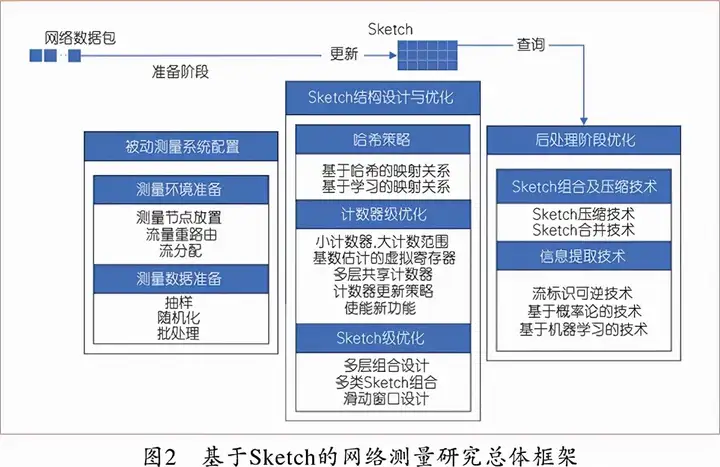
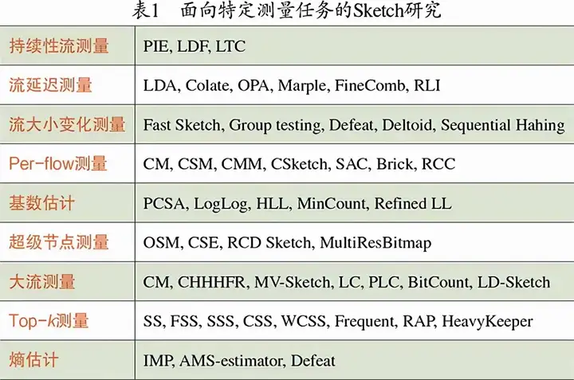

# Sketch 展望

网络设施的运行和管理需要大量网络流数据的支持，这依赖于网络测量技术。目前该技术有两个挑战：

- 能适应不同场景的网络环境，甚至适应未来的网络环境
- 云原生背景下，网络结构和流量可能快速变化。流量的高速特征使得测量变得困难，因为需要避免对吞吐量的影响；流量的非均匀性使得测量的精度受到挑战

为此，希望有一种测量算法能够避免预设网络拓扑环境以及流量的特征，从而适应不同的网络环境。而 Sketch 算法借助哈希算法，凭借其优越的性能和信息压缩存储能力，或而可以成为一种解决方案。

## 测量任务无关的 Sketch 设计

基于 Sketch 算法进行测量的核心在于压缩型数据结构的设计，一般来说需要考虑三个模块：

- 测量：配置测量系统的参数、测量数据的预处理
- 算法处理：Sketch 结构的设计和优化
- 后处理：数据的融合以及信息提取

如图所示：

其中测量模块，主要考虑减少测量对于设备性能的侵入，一方面可以减少单设备的采样率，使用多设备协同测量；另一方面可以通过数据预处理降低开销。

对于算法处理模块，主要考虑片上内存的高效利用，对于小流量的计数器，希望能够减少占用的位数，从而加大算法能够统计的流量数；对于大流量的计数器，希望能够增大计数器的位数，否则无法支持大流量。为此有一些专门的优化工作来解决。

后处理模块需要从各个设备拉取分布式测量数据，这可能占用不小的网络带宽从而影响正常的业务。一种解决方案是 Sketch 压缩与合并技术，减小测量节点和控制器之间的传输量。另外，传统 Sketch 中如果需要完成流标识的提取，一般就需要遍历整个流空间，学术界提出逆向 Sketch 的解决方案，通过把计数器抽象为随机变量建立概率模型的方式来估计流量。然而如果网络流量快速变化，模型的准确性会受到影响，因此考虑使用机器学习来动态调整模型。

## 面向特定测量任务的 Sketch 设计

通用的东西通常不会那么好，因此面向特定任务时，学术界希望做一些针对性的优化。

- 持续性流测量：除了关注流大小，也关注重复出现的分组，进而识别攻击者
- 流延迟测量：不断测量观测点之间的延迟，以便于优化网络传输路径
- 流大小变化测量：当网络流量急剧变化时，很可能预示网络故障，因此需要持续监控流量变化
- Per-Flow 测量：全量统计网络流量，以便精确分析网络的全局特征
- 基数估计：统计具有特定特征的报文总数，便于异常探测和故障筛查
- 超级传播节点测量：检测发出或收到大量流量的节点，防范 DDoS 攻击
- 大流测量：检测流量超过一定阈值的流，便于定位网络拥塞、异常原因
- Top-K 测量：变种的大流测量
- 熵估计：统计网络流量的随机性，用于异常检测、流模式聚类等

优化方式如图：

## 面向软硬件融合的 Sketch 设计

网络设备之间硬件区别很大，Sketch 需要适配不同的计算元件，如 FPGA、ASIC、CPU、GPU 等。因此需要考虑软硬件融合的设计。

而多个设备协同，可能需要考虑异构设备上 Sketch 的部署，也需要考虑好任务量的划分等等问题。

## 展望

- 预先设计好结构的 Sketch 算法灵活性不够，需要更具弹性的设计
- Sketch 算法目前无法精确估计 IPv4 和 IPv6 共存的网络流量，逆向 Sketch 更是完全不能处理这种双栈网络，需要进一步研究
- SDN 提供的可编程控制平面能力，可以天然支持 Sketch 算法的部署，需要考虑使用 TCAM 还是 SRAM 来支持 Sketch 算法
- Sketch 和机器学习的结合，可以提高 Sketch 算法的准确性。不过随着网络的变化，可能需要在线学习的理论方法来支持；并且传统的批处理训练模式，可能降低模型对于实时网络特征的敏感性，需要进一步研究模型算法
- Kubernetes 支持的云原生环境下，网络测量有待进一步研究
